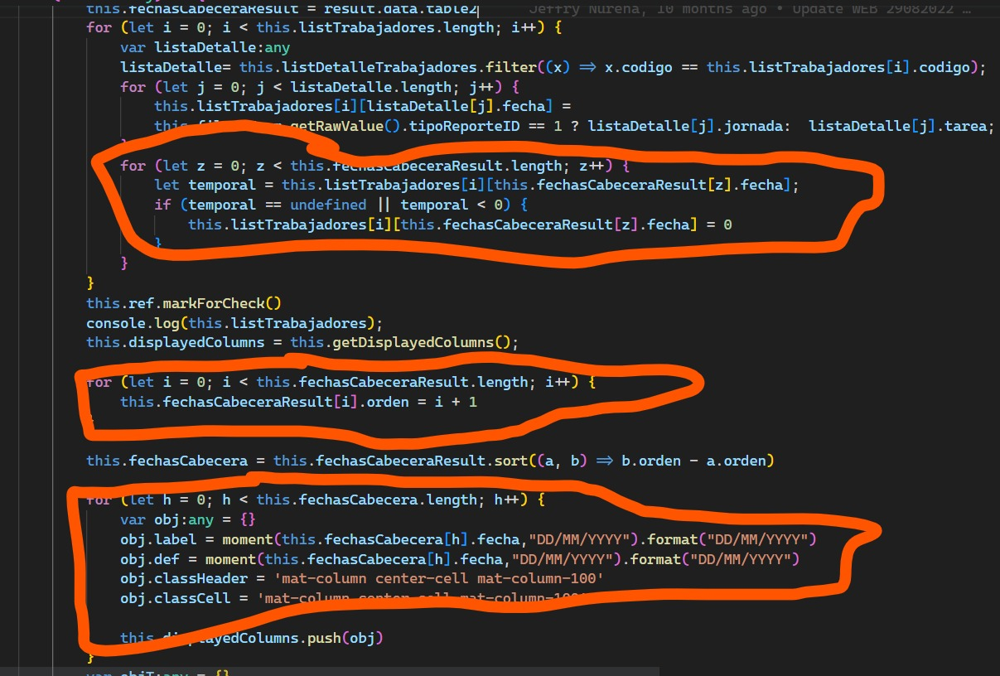
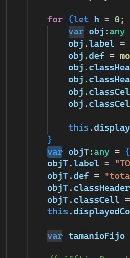
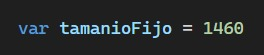
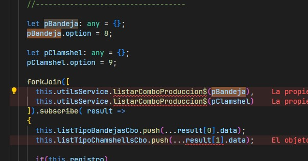
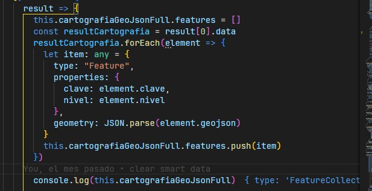

# Casos

-  1 - [Uso de funciones en SCSS](#1---uso-de-funciones-en-scss)
-  2 - [Anidar clases en SCSS](#2---anidar-clases-en-scss)
-  3 - [Uso de forkJoin en Angular](#3---uso-de-forkjoin-en-angular)
-  4 - [Simplificar filtros](#4---simplificar-filtros)
-  5 - [Uso del for of](#5---uso-del-for-of)
-  6 - [Mal uso del Var](#6---mal-uso-del-var)
-  7 - [Variables declaradas para un uso de const](#7---variables-declaradas-para-un-uso-de-const)
-  8 - [Uso de método map de los arreglos](#8---uso-de-método-map-de-los-arreglos)
-  9 - [Uso de find en lugar de filter](#9---uso-de-find-en-lugar-de-filter)

## 1 - Uso de funciones en SCSS

### Incorrecto ❌

```scss

.mat-column-100{
    flex : 0 0 100px !important;
}

.mat-column-120{
    flex : 0 0 120px !important;
}

.mat-column-140{
    flex : 0 0 140px !important;
}

```

### Correcto ✅

```scss

@for $i from 100 through 140 step 20 {
    .mat-column-#{$i}{
        flex : 0 0 #{$i}px !important;
    }
}

/*
    .mat-column-100 {
        flex: 0 0 100px !important;
    }

    .mat-column-120 {
        flex: 0 0 120px !important;
    }

    .mat-column-140 {
        flex: 0 0 140px !important;
    }
*/

```

```scss

// Tambien podemos añadir Operadores
@for $i from 1 through 10 {
  .mat-column-#{$i * 20} {
    flex: 0 0 #{$i *20}px !important;
  }
}

/*
    .mat-column-20 {
        flex: 0 0 20px !important;
    }

    .mat-column-40 {
        flex: 0 0 120px !important;
    }

    ...

    .mat-column-200 {
        flex: 0 0 140px !important;
    }
*/

```


## 2 - Anidar clases en SCSS

### Incorrecto ❌

```scss

.card{
    max-width: 10rem;
    margin-bottom: 1rem;    
}

.card .header{
    background-color: #f5f5f5;
    padding: 1rem;
}

.card .body{
    padding: 1rem;
}

.card .body:hover{
    background-color: #c1c1c1;
}

.card .footer{
    background-color: #f5f5f5;
    padding: 1rem;
}

```

### Correcto ✅

```scss

.card{
    max-width: 10rem;
    margin-bottom: 1rem;    

    .header{
        background-color: #f5f5f5;
        padding: 1rem;
    }

    .body{
        padding: 1rem;

        &:hover{
            background-color: #c1c1c1;
        }

    }

    .footer{
        background-color: #f5f5f5;
        padding: 1rem;
    }
}

```

## 3 - Uso de forkJoin en Angular

### Incorrecto ❌

```typescript

const observable1 = this.http.get('url1');
const observable2 = this.http.get('url2');
const observable3 = this.http.get('url3');

observable1.subscribe(response1 => {
    observable2.subscribe(response2 => {
        observable3.subscribe(response3 => {
            console.log(response1);
            console.log(response2);
            console.log(response3);
        });
    });    
});

```

### Correcto ✅

```typescript

import { forkJoin } from 'rxjs';

const usuarios = this.http.get('url1');
const empresas = this.http.get('url2');
const zonas = this.http.get('url3');

forkJoin([usuarios, empresas, zonas])
    .subscribe(([resUsuarios, resEmpresas, resZonas]) => {
        console.log(resUsuarios);
        console.log(resEmpresas);
        console.log(resZonas);
    });

```

## 4 - Simplificar filtros

### Incorrecto ❌


### Correcto ✅

```typescript
applyFilter(filterValue: string | null) {
    this.dataSource.filter = filterValue?.trim().toLowerCase();
}
```

## 5 - Uso del for of

### No recomendado ❌



```typescript
for (let index = 0; index < this.array.length; index++) {
    const element = this.array[index];
    console.log(element,index);   
}
```

### Recomendado ✅

```typescript
for (const element of this.array) {
    console.log(element);
}
```

```typescript
for (const [element,index] of this.array.entries()) {
    console.log(element,index);
}
```

```typescript
for (const trabajador of this.listTrabajadores) {
    const detalles = this.listDetalleTrabajadores.filter(x => x.codigo === trabajador.codigo);

    for (const detalle of detalles){
        trabajador[detalle.fecha] = tipoReporte == 1? detalle.jornada : detalle.tarea
    }

    for (const cabecera of this.fechasCabecera){
        const fechaData = trabajador[cabecera.fecha]
        if(!fechaData || fechaData < 0){
            trabajador[cabecera.fecha] = 0
        }
    }
}

this.fechasCabecera.reverse()

```

## 6 - Mal uso del Var

### No recomendado ❌







### Recomendado ✅

```typescript
const obj = {
    label:'xxxxx',
    def: mo(),
    classHead:'mat-column-100'
}
this.display.push(obj)
```

```typescript
this.display.push({
    label:'xxxxx',
    def: mo(),
    classHead:'mat-column-100'
})
```

```typescript
forkJoin([
    this.utilsService.listarComboProduccion$({ option:8 })
    this.utilsService.listarComboProduccion$({ option:9 })
]).subcribe(([]))

```

## 7 - Variables declaradas para un uso de const

### No recomendado ❌


```typescript
this.cartografiaGeoJsonFull.features = []
const resultCartografia = result[0].data
resultCartografia.forEach(element => {
  let item: any = {
    type: "Feature",
    properties: {
      clave: element.clave,
      nivel: element.nivel
    },
    geometry: JSON.parse(element.geojson)
  }
  this.cartografiaGeoJsonFull.features.push(item)
})

console.log(this.cartogradiaGeoJsonFull)
```

### Recomendado ✅

```typescript
this.cartografiaGeoJsonFull.features = []
const resultCartografia = result[0].data
resultCartografia.forEach(element => {
  const item = {
    type: "Feature",
    properties: {
      clave: element.clave,
      nivel: element.nivel
    },
    geometry: JSON.parse(element.geojson)
  }
  this.cartografiaGeoJsonFull.features.push(item)
})

console.log(this.cartogradiaGeoJsonFull)
```
```typescript
this.cartogradiaGeoJsonFull.features = result[0].data
    .map(element=>({
        type:'Faeature',
        properties:{
            clave:element.clave,
            nivel:element:nivel
        },
        geometry: JSON.parse(element.geojson||'{}')
    }))

console.log(this.cartogradiaGeoJsonFull)
```

## 8 - Uso de método map de los arreglos

### No recomendado ❌

```typescript

const list = []
for (const element of this.list) {
    const item = {
        id: element.id,
        name: element.name,
        age: element.age
    }
    list.push(item)
}

```

### Recomendado ✅

```typescript

const list = this.list.map(element => ({
    id: element.id,
    name: element.name,
    age: element.age
}))

```

## 9 - Uso de find en lugar de filter

### No recomendado ❌

```typescript

const item = this.list.filter(element => element.id === 1)[0]

```

### Recomendado ✅

```typescript
const item = this.list.find(element => element.id === 1)
```

## 10 - Uso de || para asignar valores por defecto

### No recomendado ❌

```typescript
const name = this.user.name ? this.user.name : 'Sin nombre'
```

### Recomendado ✅

```typescript
const name = this.user.name || 'Sin nombre'
```
